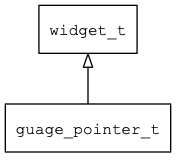

## guage\_pointer\_t
### 概述


 仪表指针控件。
### 函数
<p id="guage_pointer_t_methods">

| 函数名称 | 说明 | 
| -------- | ------------ | 
| <a href="#guage_pointer_t_guage_pointer_cast">guage\_pointer\_cast</a> | 转换为guage_pointer对象(供脚本语言使用)。 |
| <a href="#guage_pointer_t_guage_pointer_create">guage\_pointer\_create</a> | 创建guage_pointer对象 |
| <a href="#guage_pointer_t_guage_pointer_set_angle">guage\_pointer\_set\_angle</a> | 设置指针角度。12点钟方向为0度，顺时钟方向为正，单位为度。 |
| <a href="#guage_pointer_t_guage_pointer_set_image">guage\_pointer\_set\_image</a> | 设置指针的图片。 |
### 属性
<p id="guage_pointer_t_properties">

| 名属性称 | 类型 | 说明 | 
| -------- | ----- | ------------ | 
| <a href="#guage_pointer_t_angle">angle</a> | int32\_t | 指针角度。12点钟方向为0度，顺时钟方向为正，单位为度。 |
| <a href="#guage_pointer_t_image">image</a> | char* | 指针图片。图片须垂直向上，图片的中心点为旋转方向。 |
### 事件
<p id="guage_pointer_t_events">

| 事件名称 | 类型  | 说明 | 
| -------- | ----- | ------- | 
#### guage\_pointer\_cast 函数
-----------------------

* 函数功能：

> <p id="guage_pointer_t_guage_pointer_cast"> 转换为guage_pointer对象(供脚本语言使用)。


* 函数原型：

```
widget_t* guage_pointer_cast (widget_t* widget);
```

* 参数说明：

| 参数 | 类型 | 说明 |
| -------- | ----- | --------- |
| 返回值 | widget\_t* | guage\_pointer对象。 |
| widget | widget\_t* | guage\_pointer对象。 |
#### guage\_pointer\_create 函数
-----------------------

* 函数功能：

> <p id="guage_pointer_t_guage_pointer_create"> 创建guage_pointer对象


* 函数原型：

```
widget_t* guage_pointer_create (widget_t* parent, xy_t x, xy_t y, wh_t w, wh_t h);
```

* 参数说明：

| 参数 | 类型 | 说明 |
| -------- | ----- | --------- |
| 返回值 | widget\_t* | 对象。 |
| parent | widget\_t* | 父控件 |
| x | xy\_t | x坐标 |
| y | xy\_t | y坐标 |
| w | wh\_t | 宽度 |
| h | wh\_t | 高度 |
#### guage\_pointer\_set\_angle 函数
-----------------------

* 函数功能：

> <p id="guage_pointer_t_guage_pointer_set_angle"> 设置指针角度。12点钟方向为0度，顺时钟方向为正，单位为度。


* 函数原型：

```
ret_t guage_pointer_set_angle (widget_t* widget, int32_t angle);
```

* 参数说明：

| 参数 | 类型 | 说明 |
| -------- | ----- | --------- |
| 返回值 | ret\_t | 返回RET\_OK表示成功，否则表示失败。 |
| widget | widget\_t* | 控件对象。 |
| angle | int32\_t | 指针角度。 |
#### guage\_pointer\_set\_image 函数
-----------------------

* 函数功能：

> <p id="guage_pointer_t_guage_pointer_set_image"> 设置指针的图片。


* 函数原型：

```
ret_t guage_pointer_set_image (widget_t* widget, const char* image);
```

* 参数说明：

| 参数 | 类型 | 说明 |
| -------- | ----- | --------- |
| 返回值 | ret\_t | 返回RET\_OK表示成功，否则表示失败。 |
| widget | widget\_t* | 控件对象。 |
| image | const char* | 指针的图片。 |
#### angle 属性
-----------------------
> <p id="guage_pointer_t_angle"> 指针角度。12点钟方向为0度，顺时钟方向为正，单位为度。


* 类型：int32\_t

| 特性 | 是否支持 |
| -------- | ----- |
| 可直接读取 | 是 |
| 可直接修改 | 否 |
| 可持久化   | 是 |
| 可脚本化   | 是 |
| 可在IDE中设置 | 是 |
| 可在XML中设置 | 是 |
| 支通过widget_get_prop读取 | 是 |
| 支通过widget_set_prop修改 | 是 |
#### image 属性
-----------------------
> <p id="guage_pointer_t_image"> 指针图片。图片须垂直向上，图片的中心点为旋转方向。


* 类型：char*

| 特性 | 是否支持 |
| -------- | ----- |
| 可直接读取 | 是 |
| 可直接修改 | 否 |
| 可持久化   | 是 |
| 可脚本化   | 是 |
| 可在IDE中设置 | 是 |
| 可在XML中设置 | 是 |
| 支通过widget_get_prop读取 | 是 |
| 支通过widget_set_prop修改 | 是 |
