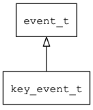

## key\_event\_t
### 概述


 按键事件。

### 函数
<p id="key_event_t_methods">

| 函数名称 | 说明 | 
| -------- | ------------ | 
| <a href="#key_event_t_key_event_cast">key\_event\_cast</a> | 把event对象转key_event_t对象，主要给脚本语言使用。 |
### 属性
<p id="key_event_t_properties">

| 名属性称 | 类型 | 说明 | 
| -------- | ----- | ------------ | 
| <a href="#key_event_t_alt">alt</a> | bool\_t | alt键是否按下。 |
| <a href="#key_event_t_capslock">capslock</a> | bool\_t | capslock键是否按下。 |
| <a href="#key_event_t_ctrl">ctrl</a> | bool\_t | ctrl键是否按下。 |
| <a href="#key_event_t_key">key</a> | uint32\_t | 键值。 |
| <a href="#key_event_t_shift">shift</a> | bool\_t | shift键是否按下。 |
#### key\_event\_cast 函数
-----------------------

* 函数功能：

> <p id="key_event_t_key_event_cast"> 把event对象转key_event_t对象，主要给脚本语言使用。


* 函数原型：

```
key_event_t* key_event_cast (event_t* event);
```

* 参数说明：

| 参数 | 类型 | 说明 |
| -------- | ----- | --------- |
| 返回值 | key\_event\_t* | 对象。 |
| event | event\_t* | event对象。 |
#### alt 属性
-----------------------
> <p id="key_event_t_alt"> alt键是否按下。


* 类型：bool\_t

| 特性 | 是否支持 |
| -------- | ----- |
| 可直接读取 | 是 |
| 可直接修改 | 否 |
| 可脚本化   | 是 |
#### capslock 属性
-----------------------
> <p id="key_event_t_capslock"> capslock键是否按下。


* 类型：bool\_t

| 特性 | 是否支持 |
| -------- | ----- |
| 可直接读取 | 是 |
| 可直接修改 | 否 |
| 可脚本化   | 是 |
#### ctrl 属性
-----------------------
> <p id="key_event_t_ctrl"> ctrl键是否按下。


* 类型：bool\_t

| 特性 | 是否支持 |
| -------- | ----- |
| 可直接读取 | 是 |
| 可直接修改 | 否 |
| 可脚本化   | 是 |
#### key 属性
-----------------------
> <p id="key_event_t_key"> 键值。


* 类型：uint32\_t

| 特性 | 是否支持 |
| -------- | ----- |
| 可直接读取 | 是 |
| 可直接修改 | 否 |
| 可脚本化   | 是 |
#### shift 属性
-----------------------
> <p id="key_event_t_shift"> shift键是否按下。


* 类型：bool\_t

| 特性 | 是否支持 |
| -------- | ----- |
| 可直接读取 | 是 |
| 可直接修改 | 否 |
| 可脚本化   | 是 |
