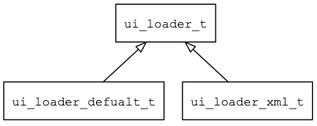

## ui\_loader\_t
### 概述

 UI加载器。

 负责从资源加载界面描述数据，然后分发给ui\_builder，由ui\_builder进一步处理。

 常见的实现有两种：

 * XML格式的加载器。

 * 二进制格式的加载器。

 


----------------------------------
### 函数
<p id="ui_loader_t_methods">

| 函数名称 | 说明 | 
| -------- | ------------ | 
| <a href="#ui_loader_t_ui_loader_load">ui\_loader\_load</a> | 加载界面描述数据，然后分发给ui\_builder，由ui\_builder进一步处理。 |
| <a href="#ui_loader_t_ui_loader_load_widget">ui\_loader\_load\_widget</a> |  |
#### ui\_loader\_load 函数
-----------------------

* 函数功能：

> <p id="ui_loader_t_ui_loader_load"> 加载界面描述数据，然后分发给ui\_builder，由ui\_builder进一步处理。


* 函数原型：

```
ret_t ui_loader_load (ui_loader_t* loader, const uint8_t* data, uint32_t size, ui_builder_t* builder);
```

* 参数说明：

| 参数 | 类型 | 说明 |
| -------- | ----- | --------- |
| 返回值 | ret\_t | 返回RET\_OK表示成功，否则表示失败。 |
| loader | ui\_loader\_t* | loader对象。 |
| data | const uint8\_t* | 数据。 |
| size | uint32\_t | 数据长度。 |
| builder | ui\_builder\_t* | 负责进一步处理，比如构建UI界面。 |
#### ui\_loader\_load\_widget 函数
-----------------------

* 函数功能：

> <p id="ui_loader_t_ui_loader_load_widget">
 从指定的资源加载widget对象，通常用于加载非窗口的widget。

>需要自己将widget加入窗口后，再调用widget\_layout。


* 函数原型：

```
widget_t* ui_loader_load_widget (const char* name);
```

* 参数说明：

| 参数 | 类型 | 说明 |
| -------- | ----- | --------- |
| 返回值 | widget\_t* | 返回widget对象。 |
| name | const char* | 资源名。 |
