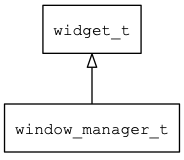

## window\_manager\_t
### 概述


 窗口管理器。
### 函数
<p id="window_manager_t_methods">

| 函数名称 | 说明 | 
| -------- | ------------ | 
| <a href="#window_manager_t_window_manager">window\_manager</a> | 获取全局window_manager对象 |
| <a href="#window_manager_t_window_manager_cast">window\_manager\_cast</a> | 转换为window_manager对象(供脚本语言使用)。 |
| <a href="#window_manager_t_window_manager_close_window">window\_manager\_close\_window</a> | 关闭窗口。 |
| <a href="#window_manager_t_window_manager_close_window_force">window\_manager\_close\_window\_force</a> | 强制立即关闭窗口。 |
| <a href="#window_manager_t_window_manager_create">window\_manager\_create</a> | 创建窗口管理器。 |
| <a href="#window_manager_t_window_manager_dispatch_input_event">window\_manager\_dispatch\_input\_event</a> | 分发输入事件。 |
| <a href="#window_manager_t_window_manager_get_top_main_window">window\_manager\_get\_top\_main\_window</a> | 获取最上面的主窗口。 |
| <a href="#window_manager_t_window_manager_init">window\_manager\_init</a> | 初始化窗口管理器。 |
| <a href="#window_manager_t_window_manager_open_window">window\_manager\_open\_window</a> | 打开窗口。 |
| <a href="#window_manager_t_window_manager_paint">window\_manager\_paint</a> | 绘制。 |
| <a href="#window_manager_t_window_manager_resize">window\_manager\_resize</a> | 调整窗口管理器的大小。 |
| <a href="#window_manager_t_window_manager_set">window\_manager\_set</a> | 设置缺省的窗口管理器。 |
| <a href="#window_manager_t_window_manager_set_cursor">window\_manager\_set\_cursor</a> | 设置鼠标指针。 |
| <a href="#window_manager_t_window_manager_set_show_fps">window\_manager\_set\_show\_fps</a> | 设置是否显示FPS。 |
### 属性
<p id="window_manager_t_properties">

| 名属性称 | 类型 | 说明 | 
| -------- | ----- | ------------ | 
| <a href="#window_manager_t_show_fps">show\_fps</a> | bool\_t | 是否显示fps。 |
#### window\_manager 函数
-----------------------

* 函数功能：

> <p id="window_manager_t_window_manager"> 获取全局window_manager对象


* 函数原型：

```
widget_t* window_manager ();
```

* 参数说明：

| 参数 | 类型 | 说明 |
| -------- | ----- | --------- |
| 返回值 | widget\_t* | 对象。 |
#### window\_manager\_cast 函数
-----------------------

* 函数功能：

> <p id="window_manager_t_window_manager_cast"> 转换为window_manager对象(供脚本语言使用)。


* 函数原型：

```
widget_t* window_manager_cast (widget_t* widget);
```

* 参数说明：

| 参数 | 类型 | 说明 |
| -------- | ----- | --------- |
| 返回值 | widget\_t* | window\_manager对象。 |
| widget | widget\_t* | window\_manager对象。 |
#### window\_manager\_close\_window 函数
-----------------------

* 函数功能：

> <p id="window_manager_t_window_manager_close_window"> 关闭窗口。


* 函数原型：

```
ret_t window_manager_close_window (widget_t* widget, widget_t* window);
```

* 参数说明：

| 参数 | 类型 | 说明 |
| -------- | ----- | --------- |
| 返回值 | ret\_t | 返回RET\_OK表示成功，否则表示失败。 |
| widget | widget\_t* | 窗口管理器对象。 |
| window | widget\_t* | 窗口对象。 |
#### window\_manager\_close\_window\_force 函数
-----------------------

* 函数功能：

> <p id="window_manager_t_window_manager_close_window_force"> 强制立即关闭窗口。


* 函数原型：

```
ret_t window_manager_close_window_force (widget_t* widget, widget_t* window);
```

* 参数说明：

| 参数 | 类型 | 说明 |
| -------- | ----- | --------- |
| 返回值 | ret\_t | 返回RET\_OK表示成功，否则表示失败。 |
| widget | widget\_t* | 窗口管理器对象。 |
| window | widget\_t* | 窗口对象。 |
#### window\_manager\_create 函数
-----------------------

* 函数功能：

> <p id="window_manager_t_window_manager_create"> 创建窗口管理器。


* 函数原型：

```
window_manager_t* window_manager_create ();
```

* 参数说明：

| 参数 | 类型 | 说明 |
| -------- | ----- | --------- |
| 返回值 | window\_manager\_t* | 返回窗口管理器对象。 |
#### window\_manager\_dispatch\_input\_event 函数
-----------------------

* 函数功能：

> <p id="window_manager_t_window_manager_dispatch_input_event"> 分发输入事件。


* 函数原型：

```
ret_t window_manager_dispatch_input_event (widget_t* widget, event_t* e);
```

* 参数说明：

| 参数 | 类型 | 说明 |
| -------- | ----- | --------- |
| 返回值 | ret\_t | 返回RET\_OK表示成功，否则表示失败。 |
| widget | widget\_t* | 窗口管理器对象。 |
| e | event\_t* | 事件对象。 |
#### window\_manager\_get\_top\_main\_window 函数
-----------------------

* 函数功能：

> <p id="window_manager_t_window_manager_get_top_main_window"> 获取最上面的主窗口。


* 函数原型：

```
widget_t* window_manager_get_top_main_window (window_manager_t* widget);
```

* 参数说明：

| 参数 | 类型 | 说明 |
| -------- | ----- | --------- |
| 返回值 | widget\_t* | 返回窗口对象。 |
| widget | window\_manager\_t* | 窗口管理器对象。 |
#### window\_manager\_init 函数
-----------------------

* 函数功能：

> <p id="window_manager_t_window_manager_init"> 初始化窗口管理器。


* 函数原型：

```
widget_t* window_manager_init (window_manager_t* widget);
```

* 参数说明：

| 参数 | 类型 | 说明 |
| -------- | ----- | --------- |
| 返回值 | widget\_t* | 返回窗口管理器对象。 |
| widget | window\_manager\_t* | 窗口管理器对象。 |
#### window\_manager\_open\_window 函数
-----------------------

* 函数功能：

> <p id="window_manager_t_window_manager_open_window"> 打开窗口。


* 函数原型：

```
ret_t window_manager_open_window (widget_t* widget, widget_t* window);
```

* 参数说明：

| 参数 | 类型 | 说明 |
| -------- | ----- | --------- |
| 返回值 | ret\_t | 返回RET\_OK表示成功，否则表示失败。 |
| widget | widget\_t* | 窗口管理器对象。 |
| window | widget\_t* | 窗口对象。 |
#### window\_manager\_paint 函数
-----------------------

* 函数功能：

> <p id="window_manager_t_window_manager_paint"> 绘制。


* 函数原型：

```
ret_t window_manager_paint (widget_t* widget, canvas_t* c);
```

* 参数说明：

| 参数 | 类型 | 说明 |
| -------- | ----- | --------- |
| 返回值 | ret\_t | 返回RET\_OK表示成功，否则表示失败。 |
| widget | widget\_t* | 窗口管理器对象。 |
| c | canvas\_t* | 画布。 |
#### window\_manager\_resize 函数
-----------------------

* 函数功能：

> <p id="window_manager_t_window_manager_resize"> 调整窗口管理器的大小。


* 函数原型：

```
ret_t window_manager_resize (widget_t* widget, wh_t w, wh_t h);
```

* 参数说明：

| 参数 | 类型 | 说明 |
| -------- | ----- | --------- |
| 返回值 | ret\_t | 返回RET\_OK表示成功，否则表示失败。 |
| widget | widget\_t* | 窗口管理器对象。 |
| w | wh\_t | 宽度 |
| h | wh\_t | 高度 |
#### window\_manager\_set 函数
-----------------------

* 函数功能：

> <p id="window_manager_t_window_manager_set"> 设置缺省的窗口管理器。


* 函数原型：

```
ret_t window_manager_set (window_manager_t* widget);
```

* 参数说明：

| 参数 | 类型 | 说明 |
| -------- | ----- | --------- |
| 返回值 | ret\_t | 返回RET\_OK表示成功，否则表示失败。 |
| widget | window\_manager\_t* | 窗口管理器对象。 |
#### window\_manager\_set\_cursor 函数
-----------------------

* 函数功能：

> <p id="window_manager_t_window_manager_set_cursor"> 设置鼠标指针。


* 函数原型：

```
ret_t window_manager_set_cursor (widget_t* widget, const char* cursor);
```

* 参数说明：

| 参数 | 类型 | 说明 |
| -------- | ----- | --------- |
| 返回值 | ret\_t | 返回RET\_OK表示成功，否则表示失败。 |
| widget | widget\_t* | 窗口管理器对象。 |
| cursor | const char* | 图片名称(从图片管理器中加载)。 |
#### window\_manager\_set\_show\_fps 函数
-----------------------

* 函数功能：

> <p id="window_manager_t_window_manager_set_show_fps"> 设置是否显示FPS。


* 函数原型：

```
ret_t window_manager_set_show_fps (widget_t* widget, bool_t show_fps);
```

* 参数说明：

| 参数 | 类型 | 说明 |
| -------- | ----- | --------- |
| 返回值 | ret\_t | 返回RET\_OK表示成功，否则表示失败。 |
| widget | widget\_t* | 窗口管理器对象。 |
| show\_fps | bool\_t | 是否显示FPS。 |
#### show\_fps 属性
-----------------------
> <p id="window_manager_t_show_fps"> 是否显示fps。


* 类型：bool\_t

| 特性 | 是否支持 |
| -------- | ----- |
| 可直接读取 | 是 |
| 可直接修改 | 否 |
| 可脚本化   | 是 |
